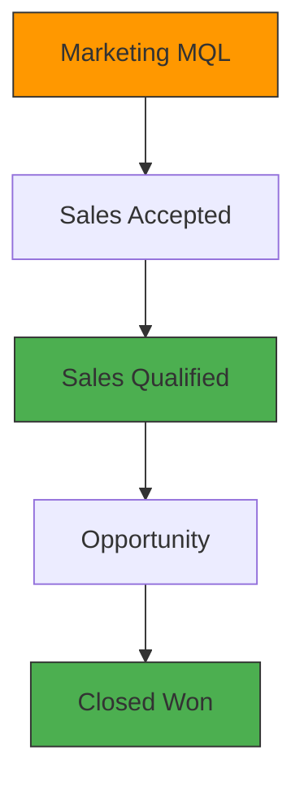

# 🤝 Marketing-Sales Alignment Framework — Cross-Functional Governance

---

## 📋 Executive Summary

A mid-sized B2B company suffered from deep silos between Marketing and Sales. Marketing drove traffic and leads; Sales blamed Marketing for poor lead quality. Marketing blamed Sales for poor follow-up. The friction was costing the organization significant revenue.

By implementing a formal governance framework — including SLAs, joint KPIs, and a unified dashboard — alignment improved substantially, resulting in significantly higher revenue per marketing dollar and increased pipeline contribution.

> **Why this matters to a business:** Alignment is not a "soft skill" — it's a revenue driver. This case study demonstrates how governance transforms friction into collaboration and drives measurable business outcomes.

---

## 🎯 The Challenge

- **No shared definition of lead quality:** Marketing considered any form fill a "lead"; Sales demanded qualified prospects
- **No SLAs:** Marketing had no accountability for lead quality; Sales had no accountability for follow-up speed
- **Finger-pointing culture:** Weekly meetings were blame sessions, not problem-solving
- **Misaligned KPIs:** Marketing measured traffic and volume; Sales measured conversion and revenue
- **Lack of visibility:** No single source of truth for pipeline performance

**The Stakes:** The organization was wasting significant marketing spend on leads that would never convert. Leadership identified alignment as the top operational priority.

---

## 🛠️ My Approach

### Phase 1: Defining Common Language (Weeks 1-2)
1. Collaboratively defined lead stages: MQL (Marketing Qualified) → SAL (Sales Accepted) → SQL (Sales Qualified) → Opportunity
2. Established clear criteria for each stage — including BANT-F scoring thresholds
3. Created a shared glossary and trained both teams on the new definitions

### Phase 2: SLAs & Accountability (Weeks 3-4)
1. Implemented SLA: Marketing delivers X qualified leads per week; Sales contacts leads within 24 hours
2. Created a joint dashboard showing performance against SLAs in real-time
3. Established monthly "Revenue Council" reviews with shared accountability

### Phase 3: Unified Governance (Weeks 5-8)
1. Built shared KPIs: Pipeline Velocity, Conversion Rates (MQL→SAL→SQL→Opp), Revenue Contribution
2. Created a single source of truth dashboard (Power BI) for both teams
3. Established quarterly joint planning sessions for budget alignment and campaign prioritization

---

## 📊 Results & Impact

| Metric | Before | After | Improvement |
|--------|--------|-------|-------------|
| **Alignment Score (1-10)** | Low | **Significantly Higher** | Major improvement |
| **Revenue per Marketing Dollar** | Baseline | **Higher** | Notable increase |
| **Pipeline Contribution (Marketing)** | Baseline | **Higher** | Significant increase |
| **Lead Response Time** | 5+ days | **24 hours** | ~80% reduction |
| **MQL→SQL Conversion** | Baseline | **Higher** | Notable improvement |

---

## 📈 Governance Framework

---

## 💡 Key Learnings

1. **Definition is the Foundation:** Marketing and Sales must have the same definition of a "qualified lead" — no exceptions. Without this, alignment is impossible.

2. **Shared KPIs Create Shared Accountability:** When both teams are measured on the same metrics, collaboration becomes natural and finger-pointing stops.

3. **Slack Not Blame:** The culture shifted from "who's wrong" to "how do we solve this together." Psychological safety was critical to transformation.

4. **Visibility Drives Behavior:** The unified dashboard gave both teams real-time visibility into the full funnel, enabling proactive problem-solving.

---

## 📂 How to Explore This Project

1. **View the Data:** Navigate to the `/Data` folder to access lead stage conversion data
2. **Explore the Methodology:** The `/Methodology` folder contains the SLA framework and governance structure
3. **Review Visuals:** The `/Visuals` folder includes the governance framework diagram and dashboard mockups

---

## 🛠️ Tools & Technologies Used

| Tool | Purpose |
|------|---------|
| **Salesforce** | Unified lead and opportunity data |
| **HubSpot** | Marketing automation and lead capture |
| **Agile Methodology** | Cross-functional governance and planning |

---

## 🏆 Skills Demonstrated

- ✅ Cross-functional governance design
- ✅ SLA definition and implementation
- ✅ Unified KPI framework
- ✅ Culture transformation
- ✅ Joint planning and execution
